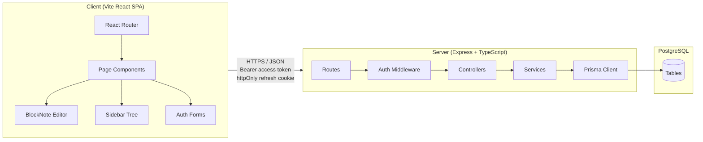
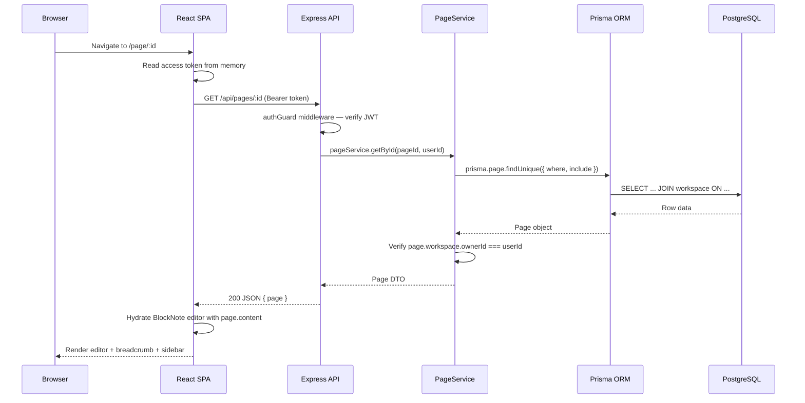
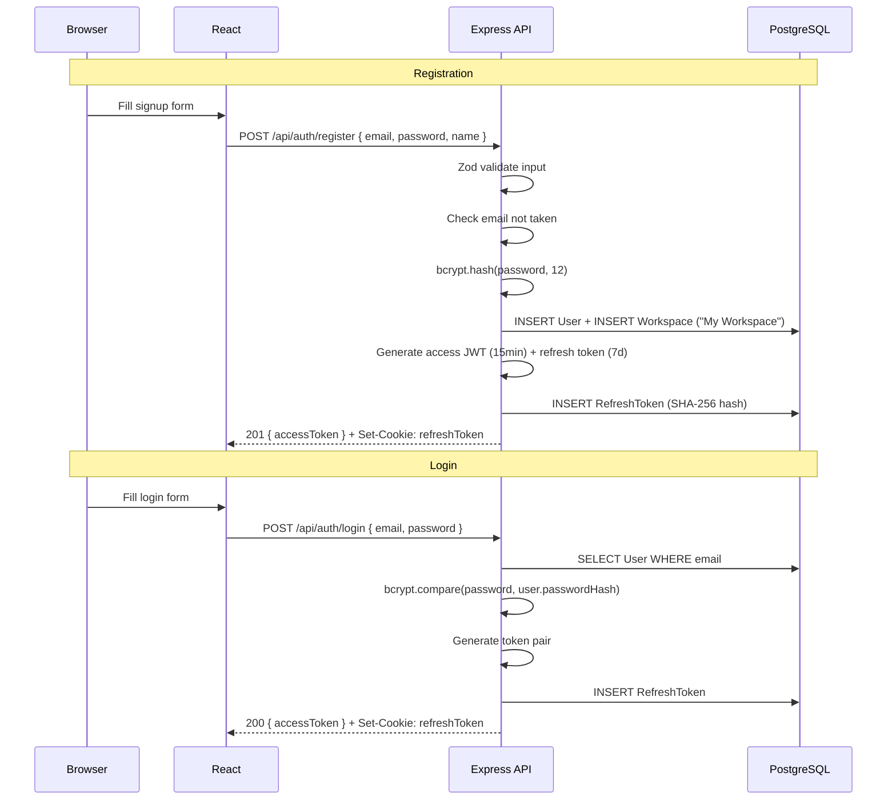
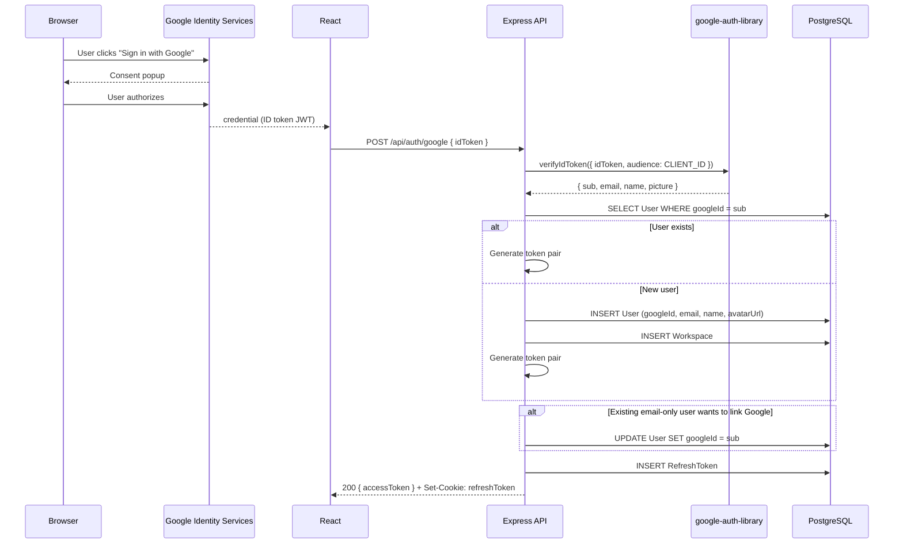
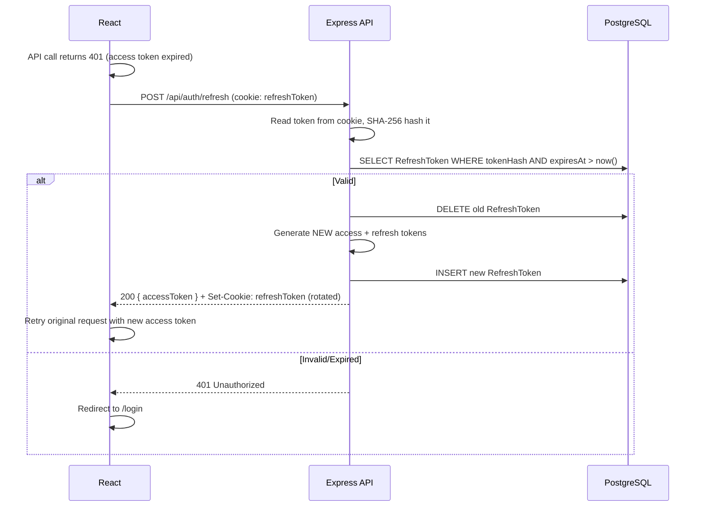

# Nestly — Production-Ready Notion-Lite Clone

## 1. Architecture Overview

### System Topology



### Request Flow — Loading a Page



### Layered Server Architecture

| Layer | Responsibility | Example |
|---|---|---|
| **Routes** | HTTP verb + path mapping, attach middleware | `router.get('/:id', authGuard, pageController.getById)` |
| **Controllers** | Parse/validate request (Zod), call service, send response | Extract `req.params.id`, call service, `res.json(result)` |
| **Services** | Business logic, authorization checks, orchestration | Verify ownership, enforce `endDate >= startDate`, build tree |
| **Prisma (lib)** | Database access, single `PrismaClient` instance | `prisma.page.findMany(...)` |
| **Middleware** | Cross-cutting: auth, errors, rate-limit, logging | JWT verification, centralized error handler |

---

## 2. Full Prisma Schema

```prisma
// prisma/schema.prisma

generator client {
  provider        = "prisma-client-js"
  previewFeatures = ["relationJoins"]
}

datasource db {
  provider = "postgresql"
  url      = env("DATABASE_URL")
}

// ─── USER ────────────────────────────────────────────────────────────
model User {
  id           String   @id @default(cuid())
  email        String   @unique
  passwordHash String?  // null for Google-only accounts
  googleId     String?  @unique  // null for email/password-only accounts
  name         String
  avatarUrl    String?
  createdAt    DateTime @default(now())
  updatedAt    DateTime @updatedAt

  workspaces    Workspace[]
  refreshTokens RefreshToken[]

  @@index([email])
}

// ─── REFRESH TOKEN ───────────────────────────────────────────────────
model RefreshToken {
  id        String   @id @default(cuid())
  userId    String
  user      User     @relation(fields: [userId], references: [id], onDelete: Cascade)
  tokenHash String   // SHA-256 hash of the actual token
  expiresAt DateTime
  createdAt DateTime @default(now())

  @@index([userId])
  @@index([tokenHash])
}

// ─── WORKSPACE ───────────────────────────────────────────────────────
model Workspace {
  id        String   @id @default(cuid())
  name      String   @default("My Workspace")
  ownerId   String
  owner     User     @relation(fields: [ownerId], references: [id], onDelete: Cascade)
  createdAt DateTime @default(now())
  updatedAt DateTime @updatedAt

  pages Page[]

  @@index([ownerId])
}

// ─── PAGE ────────────────────────────────────────────────────────────
model Page {
  id          String    @id @default(cuid())
  workspaceId String
  workspace   Workspace @relation(fields: [workspaceId], references: [id], onDelete: Cascade)

  parentId String?
  parent   Page?   @relation("PageTree", fields: [parentId], references: [id], onDelete: SetNull)
  children Page[]  @relation("PageTree")

  title    String  @default("Untitled")
  icon     String? // emoji string, e.g. "📄"
  content  Json    @default("[]") // BlockNote document JSON array

  // Ordering: fractional index string for drag-reorder (e.g. "a0", "a0V")
  sortOrder String @default("a0")

  // Page properties — date range
  startDate DateTime?
  endDate   DateTime?

  isDeleted Boolean  @default(false)
  deletedAt DateTime?

  createdAt DateTime @default(now())
  updatedAt DateTime @updatedAt

  @@index([workspaceId, parentId, isDeleted]) // Sidebar tree query
  @@index([workspaceId, isDeleted])            // Trash listing
  @@index([workspaceId, title])                // Title search
}
```

### Schema Design Reasoning

| Decision | Rationale |
|---|---|
| **`cuid()` IDs** | URL-safe, collision-resistant, sortable-ish — better than UUIDs for URLs and better than autoincrement for security (no enumeration). |
| **`googleId` on User (unique, nullable)** | Allows linking a Google account to a user. Unique constraint prevents duplicate Google accounts. Nullable because email/password users won't have one. |
| **`RefreshToken` as its own table** | Enables per-device logout, "revoke all sessions", and token rotation. Storing `tokenHash` (not plaintext) means a DB breach doesn't expose valid tokens. |
| **`onDelete: Cascade` on Workspace→User** | Deleting a user removes all their workspaces and pages. Appropriate for single-owner workspaces. |
| **`onDelete: SetNull` on Page→parent** | Deleting a parent page orphans children (promotes to root) rather than cascade-deleting an entire subtree — safer default. Permanent delete in trash will handle recursive cleanup in service code. |
| **`onDelete: Cascade` on Page→Workspace** | Deleting a workspace removes all its pages. |
| **`sortOrder` (string)** | Fractional indexing (using a library like `fractional-indexing`) allows O(1) reorder without renumbering siblings. Much better than integer positions for drag-and-drop. |
| **Composite index `[workspaceId, parentId, isDeleted]`** | The exact query pattern for loading sidebar children: "all non-deleted children of parent X in workspace Y". |
| **`deletedAt` timestamp** | Records when soft-delete happened; enables "items in trash for 30+ days" cleanup later. |
| **`content Json @default("[]")`** | BlockNote represents documents as a JSON array of Block objects. Default to empty array for new pages. |
| **`relationJoins` preview feature** | Enables Prisma to use SQL JOINs instead of multiple round-trip queries — meaningful performance improvement for nested includes. |

---

## 3. API Design

All endpoints return a consistent envelope:

```typescript
// Success
{ "data": T }

// Error
{ "error": { "code": string, "message": string, "details"?: unknown } }
```

HTTP status codes are semantic (201 for creation, 404 for not found, 422 for validation, 429 for rate limit, etc.).

---

### 3.1 Auth — `/api/auth`

| Method | Path | Auth? | Description |
|---|---|---|---|
| POST | `/api/auth/register` | No | Create account with email/password |
| POST | `/api/auth/login` | No | Login with email/password |
| POST | `/api/auth/google` | No | Login/register via Google ID token |
| POST | `/api/auth/refresh` | Cookie | Exchange refresh token for new access + refresh pair |
| POST | `/api/auth/logout` | Cookie | Revoke current refresh token |

#### `POST /api/auth/register`
```typescript
// Request body (Zod-validated)
{ email: string, password: string, name: string }

// Response 201
{ data: { user: UserDTO, accessToken: string } }
// + Set-Cookie: refreshToken=<token>; HttpOnly; Secure; SameSite=Strict; Path=/api/auth
```

#### `POST /api/auth/login`
```typescript
// Request body
{ email: string, password: string }

// Response 200
{ data: { user: UserDTO, accessToken: string } }
// + Set-Cookie: refreshToken
```

#### `POST /api/auth/google`
```typescript
// Request body
{ idToken: string }  // Google ID token from frontend Sign-In

// Response 200
{ data: { user: UserDTO, accessToken: string } }
// + Set-Cookie: refreshToken
// Creates user on first Google login (find-or-create)
```

#### `POST /api/auth/refresh`
```typescript
// No body — reads refreshToken from HttpOnly cookie
// Response 200
{ data: { accessToken: string } }
// + Set-Cookie: refreshToken (rotated)
```

#### `POST /api/auth/logout`
```typescript
// No body — reads refreshToken from cookie, deletes from DB
// Response 204 (no body)
// + Clear-Cookie: refreshToken
```

---

### 3.2 User — `/api/users`

| Method | Path | Auth? | Description |
|---|---|---|---|
| GET | `/api/users/me` | Yes | Get current user profile |
| PATCH | `/api/users/me` | Yes | Update name or avatarUrl |

#### `GET /api/users/me`
```typescript
// Response 200
{ data: { id, email, name, avatarUrl, createdAt } }
```

#### `PATCH /api/users/me`
```typescript
// Request body (all optional)
{ name?: string, avatarUrl?: string }

// Response 200
{ data: { id, email, name, avatarUrl, createdAt } }
```

---

### 3.3 Workspaces — `/api/workspaces`

| Method | Path | Auth? | Description |
|---|---|---|---|
| GET | `/api/workspaces` | Yes | Get user's workspace (returns array, but v1 always has exactly one) |
| PATCH | `/api/workspaces/:id` | Yes | Rename workspace |

#### `GET /api/workspaces`
```typescript
// Response 200
{ data: Workspace[] }
```

#### `PATCH /api/workspaces/:id`
```typescript
// Request body
{ name: string }

// Response 200
{ data: Workspace }
```

---

### 3.4 Pages — `/api/workspaces/:workspaceId/pages`

| Method | Path | Auth? | Description |
|---|---|---|---|
| GET | `/api/workspaces/:wId/pages` | Yes | Get page tree (all non-deleted pages, flat list; client builds tree) |
| GET | `/api/workspaces/:wId/pages/:id` | Yes | Get single page with full content |
| POST | `/api/workspaces/:wId/pages` | Yes | Create a page |
| PATCH | `/api/workspaces/:wId/pages/:id` | Yes | Update title, icon, content, dates, parentId, sortOrder |
| DELETE | `/api/workspaces/:wId/pages/:id` | Yes | Soft-delete (move to trash) |
| POST | `/api/workspaces/:wId/pages/:id/restore` | Yes | Restore from trash |
| DELETE | `/api/workspaces/:wId/pages/:id/permanent` | Yes | Permanently delete (and all descendants) |
| GET | `/api/workspaces/:wId/pages/trash` | Yes | List trashed pages |
| GET | `/api/workspaces/:wId/pages/search?q=` | Yes | Search pages by title |

#### `GET /api/workspaces/:wId/pages` (sidebar tree data)
```typescript
// Response 200 — flat list of all non-deleted pages (minimal fields)
{ data: PageTreeItem[] }
// PageTreeItem: { id, parentId, title, icon, sortOrder, startDate, endDate, hasChildren }
// Client reconstructs the tree in-memory for O(n) performance.
```

#### `GET /api/workspaces/:wId/pages/:id` (full page for editor)
```typescript
// Response 200
{ data: { id, workspaceId, parentId, title, icon, content: Block[],
          startDate, endDate, createdAt, updatedAt,
          breadcrumb: { id, title, icon }[] } }
// breadcrumb: ancestor chain from root → current page
```

#### `POST /api/workspaces/:wId/pages` (create)
```typescript
// Request body
{ parentId?: string, title?: string, icon?: string }

// Response 201
{ data: Page }
```

#### `PATCH /api/workspaces/:wId/pages/:id` (update)
```typescript
// Request body (all optional)
{ title?: string, icon?: string, content?: Json,
  parentId?: string | null, sortOrder?: string,
  startDate?: string | null, endDate?: string | null }

// Response 200
{ data: Page }
// Validation: if both startDate and endDate are set, endDate >= startDate
```

#### `GET /api/workspaces/:wId/pages/search?q=`
```typescript
// Query params
q: string  // min 1 char, max 100 chars

// Response 200
{ data: PageSearchResult[] }
// PageSearchResult: { id, title, icon, parentId, breadcrumb }
```

---

## 4. Auth Flow

### 4.1 Email/Password Registration + Login



### 4.2 Google Sign-In



### 4.3 Token Refresh + Rotation



### 4.4 Token Storage Strategy

| Token | Where Stored | Lifetime | Sent Via |
|---|---|---|---|
| **Access token** | React state (in-memory variable via Zustand) | 15 minutes | `Authorization: Bearer <token>` header |
| **Refresh token** | `HttpOnly`, `Secure`, `SameSite=Strict` cookie, `Path=/api/auth` | 7 days | Automatically by browser (cookie) |

> **IMPORTANT**: The access token is **never** stored in `localStorage` or `sessionStorage` — this protects against XSS token theft. The refresh cookie's `Path=/api/auth` ensures it is only sent to auth endpoints, minimizing exposure.

---

## 5. Frontend Structure

### 5.1 Folder Layout

```
client/
├── public/
│   └── favicon.svg
├── src/
│   ├── main.tsx                     # App entry
│   ├── App.tsx                      # Router + providers
│   ├── api/
│   │   ├── client.ts                # Axios instance with interceptors (auto-refresh)
│   │   ├── auth.ts                  # Auth API calls
│   │   ├── workspaces.ts            # Workspace API calls
│   │   └── pages.ts                 # Page API calls
│   ├── components/
│   │   ├── ui/                      # Reusable primitives (Button, Input, Modal, Toast, etc.)
│   │   ├── layout/
│   │   │   ├── AppLayout.tsx         # Sidebar + main content shell
│   │   │   ├── Sidebar.tsx           # Workspace name + page tree + trash
│   │   │   └── Topbar.tsx            # Breadcrumb + page actions
│   │   ├── auth/
│   │   │   ├── LoginForm.tsx
│   │   │   ├── RegisterForm.tsx
│   │   │   └── GoogleSignInButton.tsx
│   │   ├── pages/
│   │   │   ├── PageTreeItem.tsx      # Recursive sidebar node
│   │   │   ├── PageEditor.tsx        # BlockNote wrapper + autosave
│   │   │   ├── PageHeader.tsx        # Title + icon + dates badge
│   │   │   ├── PageBreadcrumb.tsx
│   │   │   ├── DateRangePicker.tsx   # Start/end date inputs
│   │   │   └── TrashList.tsx
│   │   └── search/
│   │       └── SearchDialog.tsx      # Cmd+K search modal
│   ├── hooks/
│   │   ├── useAuth.ts               # Login/logout/register + token state
│   │   ├── usePages.ts              # Page CRUD + tree queries
│   │   ├── useDebounce.ts           # Debounce for autosave
│   │   └── useSearch.ts             # Search with debounced input
│   ├── stores/
│   │   ├── authStore.ts             # Zustand — user, accessToken, isAuthenticated
│   │   └── pageStore.ts             # Zustand — page tree, active page, sidebar state
│   ├── lib/
│   │   ├── utils.ts                 # Helpers (cn(), date formatting, tree building)
│   │   └── constants.ts             # API_BASE_URL, token config
│   ├── pages/                       # Route-level page components
│   │   ├── LoginPage.tsx
│   │   ├── RegisterPage.tsx
│   │   ├── DashboardPage.tsx         # Redirects to first page or shows empty state
│   │   └── PageViewPage.tsx          # Editor view for a specific page
│   ├── types/
│   │   └── index.ts                 # Shared TypeScript interfaces (User, Page, Workspace, etc.)
│   └── styles/
│       └── index.css                # Tailwind directives + custom CSS variables
├── index.html
├── tailwind.config.ts
├── tsconfig.json
├── vite.config.ts
└── package.json
```

### 5.2 State Management — Zustand

| Store | State | Why Zustand here |
|---|---|---|
| **`authStore`** | `user`, `accessToken`, `isAuthenticated`, `isLoading` | Auth state must be globally accessible (for API interceptors, route guards, header display). Zustand is simpler than Context for cross-component reads without re-render cascading. |
| **`pageStore`** | `pages[]` (flat list), `activePage`, `expandedIds`, `sidebarWidth` | The sidebar tree, active page, and expand/collapse state are read by many components (sidebar, breadcrumb, editor, topbar). Zustand with selectors avoids unnecessary re-renders. |

> **NOTE**: **Why Zustand over Context?** For a project this size, React Context works but causes re-renders of all consumers on any state change. Zustand's selector-based subscriptions give us surgical re-renders — important for the sidebar tree which can have many nodes. It's also less boilerplate than Context + useReducer.

### 5.3 Routing Plan (React Router v7)

| Path | Component | Auth Required? | Description |
|---|---|---|---|
| `/login` | `LoginPage` | No | Login form + Google Sign-In |
| `/register` | `RegisterPage` | No | Registration form |
| `/` | `DashboardPage` | Yes | Redirects to first page or shows welcome |
| `/page/:pageId` | `PageViewPage` | Yes | Editor view inside `AppLayout` |
| `/trash` | `TrashPage` | Yes | Trash listing inside `AppLayout` |
| `*` | `NotFoundPage` | No | 404 fallback |

**Route guard**: A `<ProtectedRoute>` wrapper checks `authStore.isAuthenticated`. If false, redirects to `/login`. On app load, it attempts a silent refresh (`POST /api/auth/refresh`) to restore the session from the HttpOnly cookie.

### 5.4 Key UI Patterns

- **Autosave**: `PageEditor` uses a `useDebounce` hook (800ms delay) on the `onChange` callback from BlockNote. Calls `PATCH /api/pages/:id` with the new content JSON. Shows a subtle "Saving…" / "Saved" indicator.
- **Optimistic updates**: Sidebar tree reorder/rename updates local Zustand state immediately, then syncs to server. On failure, reverts and shows a toast.
- **Error boundary**: A React error boundary wraps the main content area. Catches render errors and shows a recovery UI instead of a white screen.
- **Toast notifications**: A toast system (built from scratch or using `sonner`) for success/error feedback on all mutations.
- **Search**: `Cmd+K` / `Ctrl+K` keyboard shortcut opens a search dialog. Debounced input queries `GET /api/pages/search?q=`. Results show title + breadcrumb path.
- **Drag-and-drop sidebar**: Using `@dnd-kit/core` for reorder + re-parent. Updates `sortOrder` (fractional index) and `parentId` on drop.

---

## 6. Security Checklist

### 6.1 Authentication & Tokens

| Measure | Implementation |
|---|---|
| Password hashing | `bcrypt` with cost factor 12 |
| Access token | Signed with `HS256`, 15-minute expiry, stored in memory only |
| Refresh token | Random 32-byte hex string, stored as SHA-256 hash in DB, 7-day expiry, `HttpOnly` + `Secure` + `SameSite=Strict` cookie |
| Token rotation | Every refresh issues a new refresh token and deletes the old one |
| Logout | Deletes refresh token from DB, clears cookie |
| Google token verification | `google-auth-library` server-side, audience check matches our client ID |

### 6.2 Input Validation

| Measure | Implementation |
|---|---|
| Request validation | Zod schemas on every controller — body, params, and query validated before any business logic |
| Email format | Zod `z.string().email()` |
| Password strength | Minimum 8 chars, max 128 chars (prevents bcrypt DoS on very long strings) |
| Title length | Max 255 chars |
| Content size | Max 1 MB JSON payload (Express `json({ limit: '1mb' })`) |
| Date validation | ISO 8601 strings, `endDate >= startDate` enforced in service layer |

### 6.3 Network & Transport

| Measure | Implementation |
|---|---|
| CORS | `cors()` middleware — whitelist only the frontend origin (`FRONTEND_URL` env var). Credentials: true. |
| Helmet | `helmet()` middleware for security headers (CSP, X-Frame-Options, etc.) |
| HTTPS | Enforced by deploy platform (Railway). Cookie `Secure` flag ensures no transmission over HTTP. |
| Rate limiting | `express-rate-limit` on `/api/auth/*` routes: 10 requests per 15-minute window per IP. Global API limit: 100 req/15 min. |

### 6.4 Data & Authorization

| Measure | Implementation |
|---|---|
| Ownership checks | Every page/workspace operation verifies `workspace.ownerId === req.userId` in the service layer |
| SQL injection | Prisma ORM parameterizes all queries by default |
| Soft delete isolation | Trashed pages excluded from tree/search queries by default |
| No sensitive data in JWTs | Access token payload: `{ sub: userId }` only — no email/name/roles |

### 6.5 Secrets Management

| Secret | Where Stored |
|---|---|
| `DATABASE_URL` | Environment variable (Railway dashboard) |
| `JWT_ACCESS_SECRET` | Environment variable (min 32 random chars) |
| `JWT_REFRESH_SECRET` | Environment variable (different from access secret) |
| `GOOGLE_CLIENT_ID` | Environment variable |
| `FRONTEND_URL` | Environment variable (for CORS whitelist) |

> **CAUTION**: Never commit `.env` files. The repo includes `.env.example` with placeholder values. All secrets are loaded via `process.env` and validated at startup (fail-fast if missing).

---

## 7. Milestone Breakdown

Each milestone is independently deployable and produces a demoable result. Milestones are ordered by dependency — each builds on the previous.

---

### Milestone 1 — Scaffold & Deploy Empty Shell
**Goal**: Prove the full deploy pipeline works end-to-end with zero features.

- [x] Initialize monorepo: `client/` (Vite + React + TS + Tailwind) and `server/` (Express + TS)
- [x] Set up Prisma with PostgreSQL, run initial migration (User + Workspace tables only)
- [x] Server: health-check endpoint `GET /api/health` → `{ status: "ok" }`
- [x] Client: landing page with "Nestly" branding, links to /login and /register (placeholder pages)
- [x] Configure CORS, Helmet, JSON body parser, centralized error handler
- [x] `.env.example`, `.gitignore`, `README.md` with setup instructions
- [ ] Deploy: client to Vercel/Netlify, server + Postgres to Railway *(deferred per Step 1.8)*
- [ ] Verify health endpoint works on deployed URL *(deferred per Step 1.8)*

**Deliverable**: Deployed app that shows a landing page and the API responds to health checks.

---

### Milestone 2 — Authentication (Email/Password + Google)
**Goal**: Full auth flow — users can register, login (both methods), refresh tokens, and logout.

- [ ] Prisma schema: add RefreshToken model, migrate
- [ ] Server: `POST /register`, `POST /login`, `POST /refresh`, `POST /logout`
- [ ] Server: `POST /google` (verify ID token, find-or-create user)
- [ ] Server: `authGuard` middleware (verify access JWT)
- [ ] Server: Rate limiting on auth routes
- [ ] Server: Zod validation on all auth inputs
- [ ] Client: Login page, Register page with forms
- [ ] Client: Google Sign-In button integration
- [ ] Client: `authStore` (Zustand), Axios interceptor for auto-refresh
- [ ] Client: `<ProtectedRoute>` wrapper, silent refresh on app load
- [ ] Client: Toast notifications for auth errors

**Deliverable**: Users can sign up, log in, see a protected dashboard (empty), and log out. Sessions persist across page refreshes via the refresh cookie.

---

### Milestone 3 — Workspace + Basic Page CRUD
**Goal**: Users can create, view, rename, and delete pages. Sidebar shows a flat list.

- [ ] Prisma schema: add Page model (full schema), migrate
- [ ] Server: Auto-create workspace on user registration
- [ ] Server: `GET /workspaces`, `PATCH /workspaces/:id`
- [ ] Server: Page endpoints — create, get by ID, update (title/icon), soft delete, list (flat)
- [ ] Server: Ownership authorization in service layer
- [ ] Client: `AppLayout` with sidebar + main content area
- [ ] Client: Sidebar showing flat page list (no nesting yet)
- [ ] Client: Create new page button
- [ ] Client: Page view with editable title + icon picker (emoji)
- [ ] Client: Soft delete → move to trash
- [ ] Client: Workspace name display + rename

**Deliverable**: Users can create pages, see them in a sidebar, edit titles and icons, and delete pages.

---

### Milestone 4 — Nested Sidebar Tree + Navigation
**Goal**: Pages support nesting. Sidebar shows a recursive, expandable/collapsible tree. Breadcrumbs work.

- [ ] Server: Page creation with `parentId`, update `parentId` (re-parent)
- [ ] Server: Breadcrumb computation (ancestor chain query)
- [ ] Client: Build tree from flat page list in `pageStore`
- [ ] Client: `PageTreeItem` — recursive component with expand/collapse, indent levels
- [ ] Client: Drag-and-drop reorder + re-parent (`@dnd-kit/core` + fractional indexing)
- [ ] Client: `sortOrder` updates via `PATCH`
- [ ] Client: Breadcrumb component showing ancestor chain
- [ ] Client: Sub-page creation (from page header or sidebar context menu)

**Deliverable**: Full nested page tree in the sidebar with drag-and-drop reordering, breadcrumb navigation.

---

### Milestone 5 — BlockNote Editor Integration
**Goal**: Pages have a rich text editor. Content autosaves.

- [ ] Install `@blocknote/core`, `@blocknote/react`, `@blocknote/mantine`
- [ ] Client: `PageEditor` component wrapping `BlockNoteView`
- [ ] Client: Load `page.content` JSON into editor on page open
- [ ] Client: Debounced autosave (800ms) — `PATCH` content on change
- [ ] Client: "Saving…" / "Saved ✓" indicator in topbar
- [ ] Server: Validate content JSON size (max 1 MB)
- [ ] Test: Create page, type rich content, refresh, verify content persists

**Deliverable**: Full block-based rich text editing with all standard formatting, slash commands, drag-to-reorder blocks, and reliable autosave.

---

### Milestone 6 — Trash, Dates, and Search
**Goal**: Complete the remaining v1 features.

- [ ] **Trash**: Trash page listing, restore, permanent delete (recursive)
- [ ] Server: `GET /pages/trash`, `POST /pages/:id/restore`, `DELETE /pages/:id/permanent`
- [ ] Server: Permanent delete cascades to all descendants
- [ ] Client: Trash view with restore/delete buttons
- [ ] **Dates**: Start date / end date on pages
- [ ] Server: Validate `endDate >= startDate` in service layer
- [ ] Client: `DateRangePicker` component in page header
- [ ] Client: Date badges in sidebar tree items
- [ ] **Search**: Title search
- [ ] Server: `GET /pages/search?q=` with Prisma `contains` (case-insensitive)
- [ ] Client: `Cmd+K` search dialog, debounced query, result list with breadcrumbs
- [ ] Client: Click result → navigate to page

**Deliverable**: All v1 features are functional — trash management, page dating, and title search.

---

### Milestone 7 — Polish, Responsive, & Production Hardening
**Goal**: Production-quality UX and robustness.

- [ ] Responsive layout: sidebar collapses to hamburger on mobile
- [ ] Loading skeletons for sidebar tree and page editor
- [ ] Error boundary around main content area
- [ ] Empty states (no pages yet, no search results, empty trash)
- [ ] Keyboard shortcuts (Cmd+K search, Cmd+N new page)
- [ ] Backend: structured logging (pino or winston) — request ID, user ID, duration
- [ ] Backend: startup validation of all required env vars
- [ ] Frontend: proper `<title>` and meta tags per page
- [ ] Final visual polish: animations, transitions, dark mode refinement
- [ ] End-to-end manual testing of all flows
- [ ] Update `README.md` with complete setup and deployment instructions

**Deliverable**: Production-ready v1 — polished, responsive, robust, well-logged, and fully documented.

---

## 8. Resolved Design Decisions

| Question | Decision |
|---|---|
| Dark mode strategy | **Dark-only** for v1 |
| Sidebar DnD library | **@dnd-kit/core** |
| Emoji picker | **Both** — text input + emoji-mart popup |
| Profile avatars | **Google picture auto-set** / generated initials for email users |
| Deploy platform | **Railway** (server + Postgres) |

---

## Stretch Goals (Explicitly Out of v1 Scope)

These are documented for future reference but **will not be built** in v1:

| Feature | Complexity | Notes |
|---|---|---|
| Full-text search into page content | Medium | Would require indexing BlockNote JSON blocks, possibly with PostgreSQL `tsvector` or a search service |
| Calendar/timeline view for dated pages | Medium | Visual calendar component showing pages by start/end dates |
| Public read-only share links | Medium | Requires a `shareToken` on pages, a public API route, and a read-only editor view |
| Real-time collaborative editing | High | Requires WebSocket server, operational transforms or CRDT (e.g., Yjs), conflict resolution |
| Multi-workspace switching | Low–Medium | UI for workspace list, workspace creation, switching context |
| Team invites & roles | High | Invitation system, role-based access control, workspace membership model |
| Page version history | Medium | Snapshot content on save, diff viewer |
| Page templates | Low | Pre-defined content JSON blobs, template picker on page creation |
| Favorites / pinned pages | Low | Boolean flag or separate table, pinned section at top of sidebar |
| Page comments | Medium | Comment model, inline or page-level threading |
